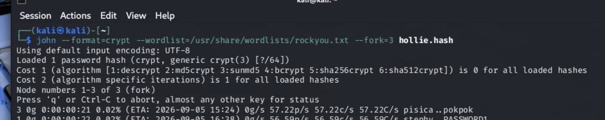
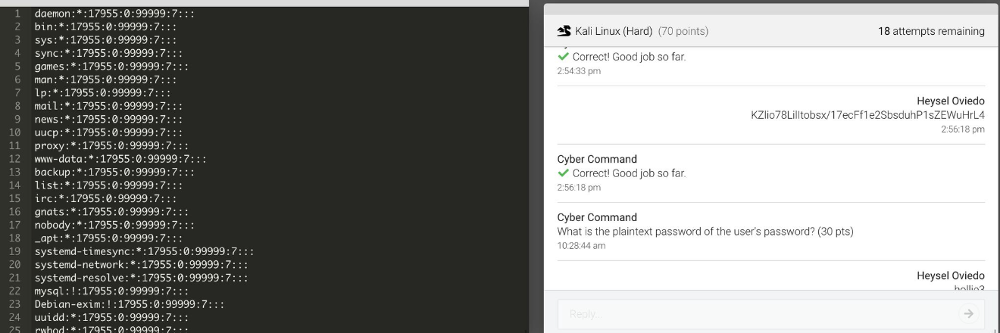

# Linux Credential Analysis & Password Recovery

## Objective

This project focused on analyzing a Linux `/etc/shadow` file to identify the only user account with a stored password hash and recover the user's plaintext password. I examined the structure of the shadow entry, interpreted the password-aging value, identified the yescrypt hash components, isolated the credential into its own file, and used John the Ripper to test password-recovery methods. The challenge demonstrated how information stored in Linux credential files can be analyzed during a password-recovery investigation.

### Skills Learned

- Analyzed a Linux `/etc/shadow` file and identified an account containing an actual password hash.
- Interpreted colon-separated shadow-file fields and password-aging information.
- Converted the password's last-change value from days since the Unix epoch into a calendar date.
- Recognized a yescrypt password hash and separated its salt from its hash digest.
- Extracted a target credential into a separate file for password testing.
- Used John the Ripper with the RockYou wordlist to perform a dictionary attack.
- Learned why yescrypt is significantly slower to test than simpler password hashes.
- Used information about the target account to understand why a targeted cracking method can outperform a broad wordlist attack.

### Tools Used

- **Kali Linux** — used as the Linux environment for reviewing the credential data and running password-recovery commands.
- **John the Ripper** — used to test candidate passwords against the extracted yescrypt password hash.
- **RockYou wordlist** — used as the candidate password list during the initial dictionary attack.
- **`cat`** — used while reviewing and working with the extracted credential data.
- **`date`** — used to convert the shadow file's password-aging value into a readable date.

## Steps

### Step 1: Analyze the `/etc/shadow` File

I reviewed the provided Linux `/etc/shadow` file. Most system accounts contained locked password fields, represented by values such as `*` or `!`. The account **hollie** was the only user that contained an actual password hash, so I identified it as the account that needed further analysis.



*Ref 1: Reviewing the Linux shadow-file data to identify the only user account containing an actual password hash.*

### Step 2: Interpret the Password-Aging Value

The shadow entry for Hollie contained the value `18934` in the field that records when the password was last changed. This value represents the number of days since January 1, 1970.

I converted it with:

```bash
date -d '1970-01-01 + 18934 days'
```

The result showed that the password was last changed on:

```text
2021-11-03
```

This allowed me to answer the password-aging portion of the challenge using information directly from the shadow entry.

### Step 3: Analyze the yescrypt Password Hash

I then broke down Hollie's password field. The `$y$` identifier showed that the password was stored using **yescrypt**.

From the shadow entry, I identified the following components:

```text
Salt:
/WzixhAsn8sdXhCquYzh01

Hash digest:
KZlio78LilItobsx/17ecFf1e2SbsduhP1sZEWuHrL4
```

Separating these components helped me understand the structure of the stored Linux credential before attempting password recovery.

### Step 4: Extract the Target Hash

Instead of working with the entire shadow file, I saved Hollie's password hash into a separate file named:

```text
hollie.hash
```

This gave John the Ripper a single target hash to process.

### Step 5: Test the Hash With John the Ripper

I first used John the Ripper with the RockYou wordlist:

```bash
john --wordlist=/usr/share/wordlists/rockyou.txt hollie.hash
```

The attack worked, but progress was very slow because the target used yescrypt. Unlike the MD5 hashes from the easier password-cracking challenge, yescrypt is intentionally more computationally expensive to test.



*Ref 2: John the Ripper running a RockYou wordlist attack against the extracted yescrypt hash stored in `hollie.hash`.*

### Step 6: Recover the Password

A more targeted approach was effective because the password was closely related to the username. The plaintext password was successfully recovered as:

```text
hollie03
```

This challenge showed that password recovery is not only about testing as many passwords as possible. Understanding the account and selecting an appropriate cracking method can make the process more effective, especially when working with a deliberately slow password-hashing algorithm such as yescrypt.
